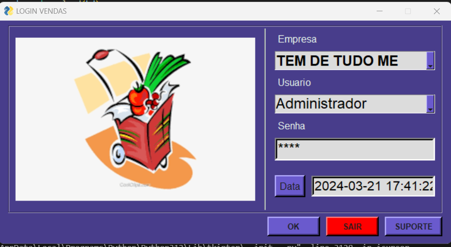
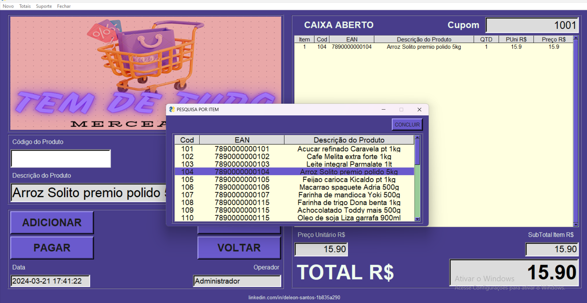
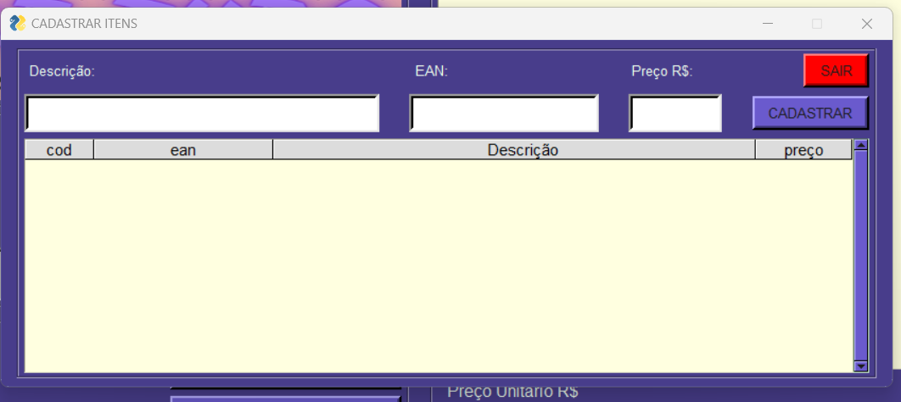
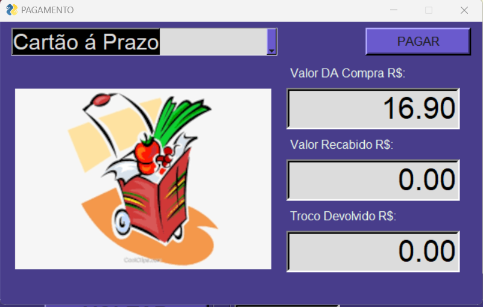
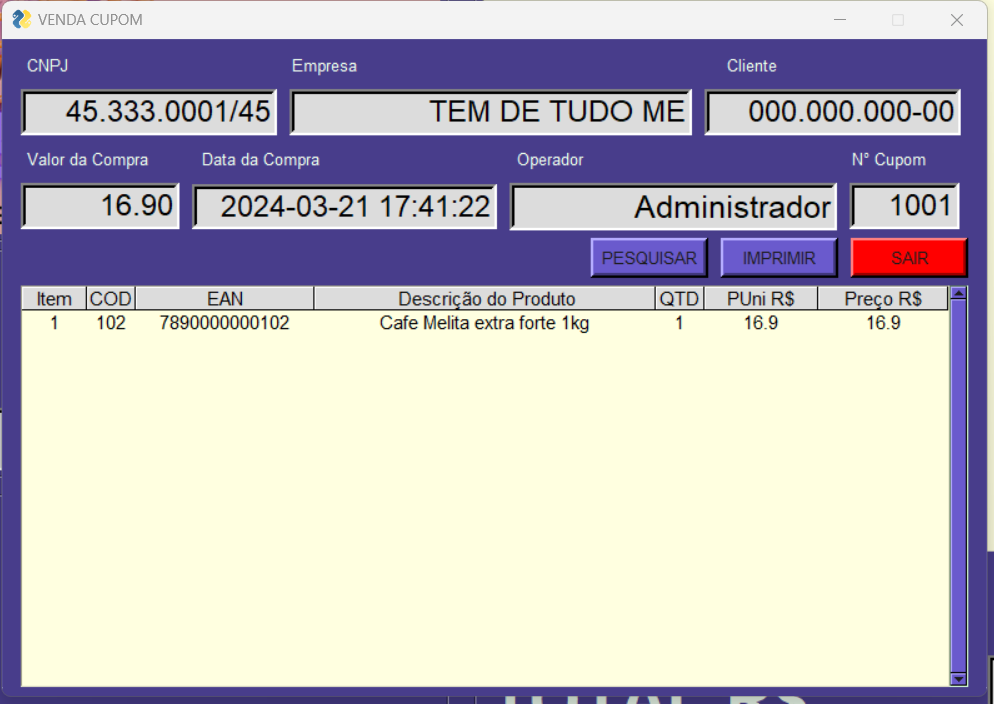

# APP VENDAS


## Sistema de Cobrança em Caixa de Supermercados

Este projeto é um sistema de registro do tipo 'Caixa Registradora'. Utiliza a biblioteca PySimpleGUI para criar uma interface gráfica que facilita a gestão de vendas em supermercados e estabelecimentos similares.

## Tecnologias Usadas

- **Python 3.7+**
- **PySimpleGUI**: Para a criação da interface gráfica.
- **json**: Para manipulação de dados persistentes.
- **ReportLab**: Para geração de PDFs (se necessário implementar).

## Funcionalidades

### Gestão de Caixa

- **Abertura e Fechamento do Caixa**: Controle do estado do caixa, abertura de novos cupons e fechamento ao final das operações.

### Registro de Vendas

- **Adicionar Itens ao Carrinho**: Permite adicionar produtos ao carrinho de compras com base no código EAN.
- **Remover Itens do Carrinho**: Permite remover produtos já adicionados ao carrinho.
- **Atualização de Preços e Totais**: Calcula automaticamente os preços unitários e totais dos itens no carrinho.

### Consulta de Produtos
- **Pesquisa de Produtos**: Permite buscar produtos no banco de dados pelo código ou descrição.

### Cadastro de Produtos

- **Adicionar Novos Produtos**: Permite o cadastro de novos produtos no sistema.

### Pagamentos

- **Processamento de Pagamentos**: Calcula o valor total a pagar e registra a venda em dinheiro, cartão ou pix.

### Relatórios

- **Visualização de Vendas Realizadas**: Exibe um histórico das vendas efetuadas a partir do numero do cupom.

### Geração de PDFs
- **Impressão de Compras em PDF**: Gera um recibo da compra em formato PDF para impressão .

## Estrutura do Projeto

```plaintext
├── modulo_entra.py
├── modulo_registra.py
├── modulo_pagar.py
├── modulo_remover.py
├── modulo_pesquisar.py
├── modulo_cadastro.py
├── modulo_limpar.py
├── modulo_adicionar.py
├── modulo_visualisar.py
├── modulo_imprimir.py
├── dados
│   ├── bd.txt
│   ├── ajuda.txt
└── imagem
    └── imagem_venda.png
```
## Desenvolvedor
- **Deleon Santos**: Este é um projeto autoral para fins academico, esta em desenvolvimento e segue conforme aprendo novas tecnologias ou maneiras de resolver problemas.

## Versão
- **v2.1.1**


